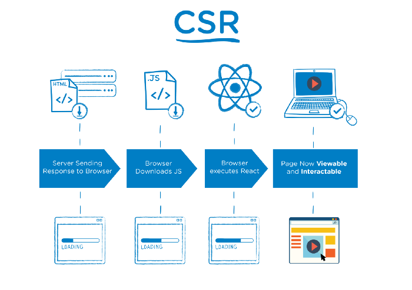
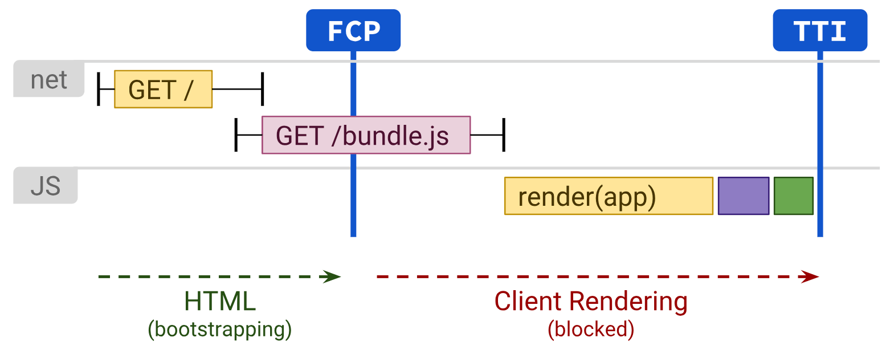
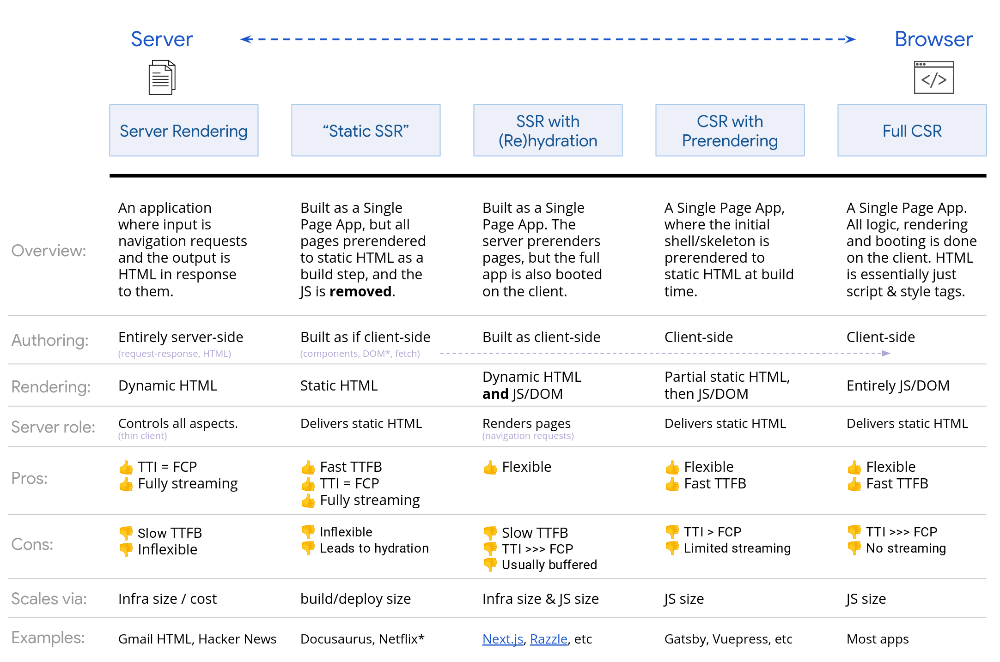

## 웹 렌더링의 종류(CSR, SSR, SSG)

## 렌더링과 렌더링 과정
렌더링과 렌더링 과정은 아래 사이트에 잘 정리되어있습니다. 
[브라우저 렌더링 과정 - Reflow Repaint, 그리고 성능 최적화](https://boxfoxs.tistory.com/408)
## SEO란?
대부분의 웹 크롤러, 봇들은 JS를 실행시키지 못하고 HTML에서만 컨텐츠를 수집하기 때문에
CSR 방식으로 개발된 페이지를 빈 페이지로 인식하게 됩니다.
SSR 방식은 View를 서버에서 전부 렌더링하기 때문에 HTML에 모든 컨텐츠가 저장되어 있어 SEO를 사용하는데 문제가 없습니다.

## CSR vs SSR
CSR과 SSR에 차이점에 그림을 통해 간단히 확인해보겠습니다.

이제 자세히 알아보겠습니다.
FCP TTI등 용어에 대해 모르시는 분들께서는 이 게시물을 보고 와주세요

### CSR
클라이언트 측 렌더링은 빈 HTML파일에, 서버에서 받은 자바스크립트 파일을 사용하여 브라우저에서 페이지를 직접 렌더링 합니다.

장점: 자바스크립트 번들 파일을 다운받고 실행한 후에는 페이지 전환 등이 빠릅니다. 

단점: 자바스크립트 번들 파일이 커질수록 FCP 까지의 시간이 길어집니다. (사용자 이탈률에 중요한 시간) 빈 페이지에 javascript를 호출해서 받는 방식이므로, 검색 엔진 최적화(SEO)가 잘 안된다.(하지만 Google Bot은 잘 된다. 크롤링하는 요소중에 Javascript도 지원하기 때문에)
FCP 시간 동안 빈 페이지가 보이므로 대부분의 사이트에서 이 부분을 로딩 아이콘으로 대체합니다. 

### SSR
요청한 페이지의 전체 HTML을 서버에서 생성해서 전송
장점: 
FCP 까지의 시간이 빠르다. 
페이지 로직 및,페이지 렌더링을 서버에서 실행하므로 많은 자바스크립트를 클라이언트에 보내지 않아도 되므로 TTI도 빠릅니다.
빈 페이지에 javascript를 호출하는 것이 아닌, 모든 정보가 포함된 HTML을 보여주므로 SEO가 잘된다.

단점 : 
// 페이지를 요청할 때 마다 새고로침(깜빡거림)이 발생하여 사용자 경험이 안 좋아집니다.
CSR은 서버에서 상대적으로 작은 응답을 받는 것에 비해, SSR은 페이지의 HTML을 작성하는 시간 때문에 TTFB가 상대적으로 느립니다.
간단한 요청도 서버를 통해야 합니다. 즉 요청이 많아지면 서버에 무리가 갑니다.
  

회사들의 SSR 도입기를 확인해주세요!
https://d2.naver.com/helloworld/7804182

## Client Side Rendering

Rehydration : https://stackoverflow.com/a/33790716

Rehydration: 클라이언트가 서버에서 렌더링 한 HTML의 DOM 트리와 데이터를 재사용하도록 자바 스크립트 뷰를 "부팅"합니다.
Prerendering: 빌드 타임에 클라이언트 측 애플리케이션을 실행하여 초기 상태를 정적 HTML로 캡처합니다.

SSR vs CSR
SSR: Server-Side Rendering (서버 측 렌더링) - 클라이언트 측 또는 유니버설 앱을 서버의 HTML로 렌더링합니다.
CSR: Client-Side Rendering (클라이언트 측 렌더링) - 브라우저에서 애플리케이션을 렌더링합니다. 일반적으로 DOM을 사용합니다.

아래의 그림은 서버 - 클라이언트 방식의 스펙트럼을 보여줍니다.

 

[The Benefits of Server Side Rendering Over Client Side Rendering](https://medium.com/walmartglobaltech/the-benefits-of-server-side-rendering-over-client-side-rendering-5d07ff2cefe8) 
[Web Rendering](https://developers.google.com/web/updates/2019/02/rendering-on-the-web)
